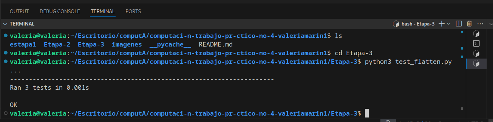

# Trabajo Práctico 4: Recursividad

## Información del Alumno
- Nombre: valeria 
- Apellido: marin morales 
- Legajo:

## Objetivos
- Comprender y aplicar el concepto de recursividad
- Implementar soluciones iterativas y recursivas para problemas clásicos
- Practicar el desarrollo guiado por pruebas (TDD)
- Trabajar con estructuras de datos anidadas
- Utilizar el framework de testing unittest de Python

## Requisitos Previos
- Python 3.x
- Conocimientos básicos de programación
- Git y GitHub
- unittest (incluido en la biblioteca estándar de Python)

## Estructura del Trabajo
El trabajo está dividido en etapas, cada una debe ser implementada en commits separados dentro del mismo repositorio:

### Etapa 1: Factorial
Implementar dos versiones de la función factorial:
1. Versión iterativa
2. Versión recursiva

**Requisitos:**
- Crear un archivo `factorial.py` con las implementaciones
- Crear un archivo `test_factorial.py` con los casos de prueba
- Implementar manejo de casos especiales (números negativos, cero)
- Documentar las funciones con docstrings

### Etapa 2: Fibonacci
Implementar dos versiones de la función fibonacci:
1. Versión iterativa
2. Versión recursiva

**Requisitos:**
- Crear un archivo `fibonacci.py` con las implementaciones
- Crear un archivo `test_fibonacci.py` con los casos de prueba
- Implementar manejo de casos especiales (números negativos, cero)
- Documentar las funciones con docstrings

### Etapa 3: Aplanar Listas
Implementar una función recursiva que aplane listas anidadas.

**Requisitos:**
- Crear un archivo `flatten.py` con la implementación
- Crear un archivo `test_flatten.py` con los casos de prueba
- Manejar diferentes tipos de estructuras de datos anidadas

## Casos de Prueba

### Caso 1: Lista Simple
```python
lista = [1, 2, 3, 4]
resultado_esperado = [1, 2, 3, 4]
```

### Caso 2: Lista con Listas Anidadas
```python
lista = [1, [2, 3], [4, [5, 6]]]
resultado_esperado = [1, 2, 3, 4, 5, 6]
```

### Caso 3: Lista con Diferentes Estructuras
```python
lista = [1, (2, 3), {'a': 4, 'b': 5}, [6, [7, 8]]]
resultado_esperado = [1, 2, 3, 'a', 4, 'b', 5, 6, 7, 8]
```

## Criterios de Evaluación
1. Correctitud de las implementaciones
2. Cobertura de casos de prueba
3. Calidad del código (legibilidad, documentación)
4. Uso correcto de TDD
5. Manejo de casos especiales
6. Organización del repositorio

## Entrega
Para cada etapa:
1. Realizar un commit con los cambios correspondientes
2. Incluir los archivos de implementación y pruebas
3. Incluir un README.md con:
   - Descripción del problema
   - Instrucciones de ejecución
   - Ejemplos de uso
   - Capturas de pantalla de los tests ejecutados

## Notas Importantes
- Cada etapa debe ser implementada en commits separados
- Los tests deben ejecutarse correctamente
- El código debe estar documentado
- Se debe seguir el enfoque TDD


# Trabajo Práctico: Recursividad y TDD

## Etapa 1: Factorial

### Descripción del problema

En esta etapa, se implementan dos funciones para calcular el factorial de un número:

1. **Versión Iterativa**: Usa un bucle `for` para calcular el factorial de un número.
2. **Versión Recursiva**: Usa recursión (la función se llama a sí misma) para calcular el factorial.

Se manejan casos especiales, como números negativos, que lanzan un error de tipo `ValueError`.

---

### Instrucciones de ejecución

Para correr los tests y verificar que las funciones funcionan correctamente, ejecutá lo siguiente en la terminal:

```bash
python3 test_factorial.py

## Etapa 2 - Parte A: Refactorización de Factorial

Se refactorizaron las funciones del cálculo de factorial (`factorial_iterative` y `factorial_recursive`) para incluir:
- Docstrings explicativos
## Etapa 2 - Parte B: Implementación de Fibonacci

Se implementaron dos versiones de la función Fibonacci:
- Iterativa (`fibonacci_iterative`)
- Recursiva (`fibonacci_recursive`)

Incluyen:
- Manejo de errores para entradas inválidas (n < 1)
- Docstrings explicativos
- Pruebas unitarias completas con `unittest`

## Etapa 3

Creamos una función recursiva llamada `flatten` que toma una lista que puede contener otras listas anidadas (listas dentro de listas) y devuelve una lista “aplanada” (sin anidamientos).

Luego, hicimos un archivo de pruebas (`test_flatten.py`) que verifica si la función funciona correctamente con varios casos de prueba usando `assert`.

Finalmente, se ejecutaron los tests y se tomó una captura de pantalla con el resultado exitoso.


